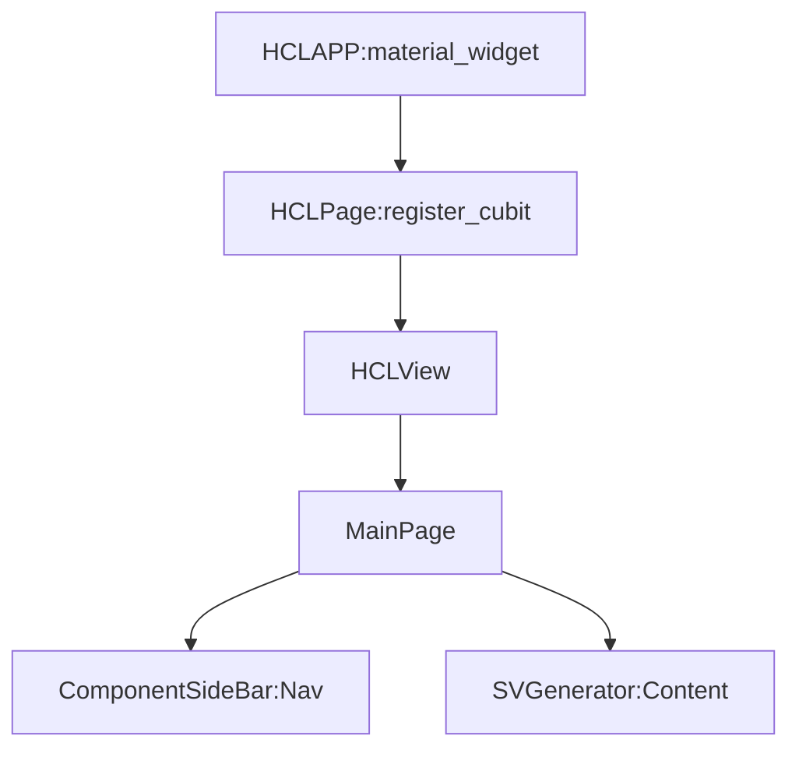

# ROHD-HCL Flutter Configuration App

This is a web app that allows RTL generation (SystemVerilog) based on the specific configuration.

For local testing:

```shell
cd confapp
flutter run --profile -d web-server --web-hostname=0.0.0.0 --web-port=3000
```

## Widget Tree



----------------

Copyright (C) 2023-2024 Intel Corporation
SPDX-License-Identifier: BSD-3-Clause
