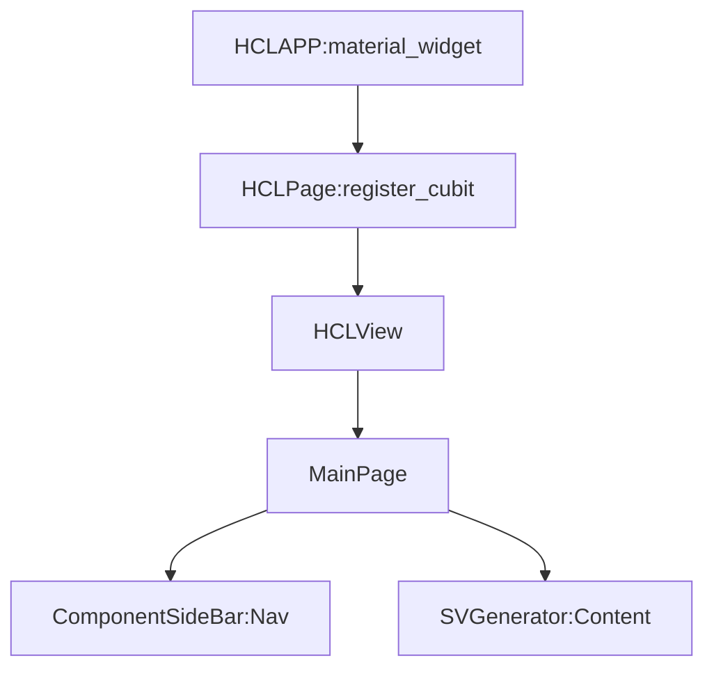

# ROHD-HCL Configuration App

The Flutter configuration app exposes selected ROHD-HCL components through
editable configuration knobs and presents generated ROHD schematics, ROHD
source, SystemVerilog, and synthesized schematics.

For workspace setup, dependency sources, running the app, and browser
validation, see [DEVELOPER.md](DEVELOPER.md).

## Adding a component to Confapp

Adding a reusable library component and making it configurable are related but
separate steps. The component must first be implemented, exported, documented,
and tested in the root package. Then complete the following Confapp work.

### 1. Create a configurator

Add a `Configurator` implementation under
`lib/src/component_config/components/`. It supplies:

- the user-facing `name`;
- a `Map<String, ConfigKnob<dynamic>>` describing editable settings; and
- `createModule()`, which constructs the configured ROHD module.

Follow an existing configurator for the relevant component family. Keep the
configurator's default settings buildable and useful for schematic generation.

### 2. Register it

Add an instance to
[`componentRegistry`](../lib/src/component_config/components/component_registry.dart).
The registry supplies the Confapp sidebar through
[`ComponentCubit`](lib/hcl/cubit/component_cubit.dart) and is also consumed by
[`gen/generate.dart`](../gen/generate.dart) for documentation netlists.

### 3. Add ROHD source mapping

Map every concrete module runtime type that the configurator can create in
[`moduleSourceAssets`](lib/hcl/module_source_assets.dart). This enables the
ROHD Source view and source cross-probing. Point to the source path beneath
`lib/src/`, using the `rohd_src/` asset prefix.

Run the source asset generator from the repository root after source changes:

```bash
bash tool/generate_confapp_assets.sh
```

It mirrors `lib/src/` into the ignored `confapp/assets/rohd_src/` directory and
updates the generated asset-directory list in `confapp/pubspec.yaml`.

### 4. Verify all generated views

Confapp builds the selected module and generates:

- native ROHD netlist JSON for `rohd_schematic_viewer`;
- generated SystemVerilog;
- a Yosys synthesized schematic when enabled; and
- source-navigation data when the ROHD Source view is enabled.

Exercise the default configurator values and representative knob values in the
running app. Confirm source navigation reaches the mapped asset and that
schematic generation does not rely on external signals crossing a module
boundary.

### 5. Add regression coverage

At minimum:

- add functional and nested-composition tests for the component in `test/`;
- update tests for changed configurator defaults or knobs; and
- run
  [`module_source_assets_test.dart`](test/hcl/module_source_assets_test.dart)
  to verify registry and bundled-source coverage.

## Widget Tree


```mermaid
flowchart TD;
    HCLAPP:material_widget-->HCLPage:register_cubit-->HCLView-->MainPage --> ComponentSideBar:Nav & SVGenerator:Content
```

----------------

Copyright (C) 2023-2026 Intel Corporation
SPDX-License-Identifier: BSD-3-Clause
