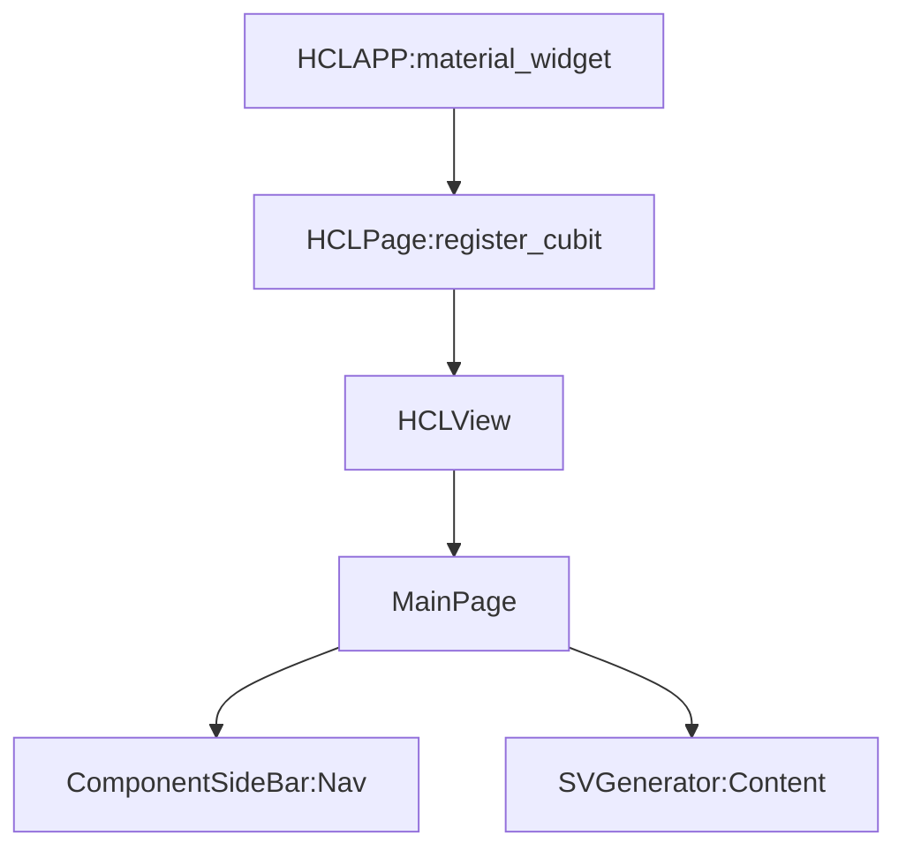

# ROHD-HCL Flutter Configuration App

This is a beta web app that allows RTL generation (system verilog) based on the specific configuration.

## Widget Tree

```mermaid
flowchart TD;
    HCLAPP:material_widget-->HCLPage:register_cubit-->HCLView-->MainPage --> ComponentSideBar:Nav & SVGenerator:Content
```
