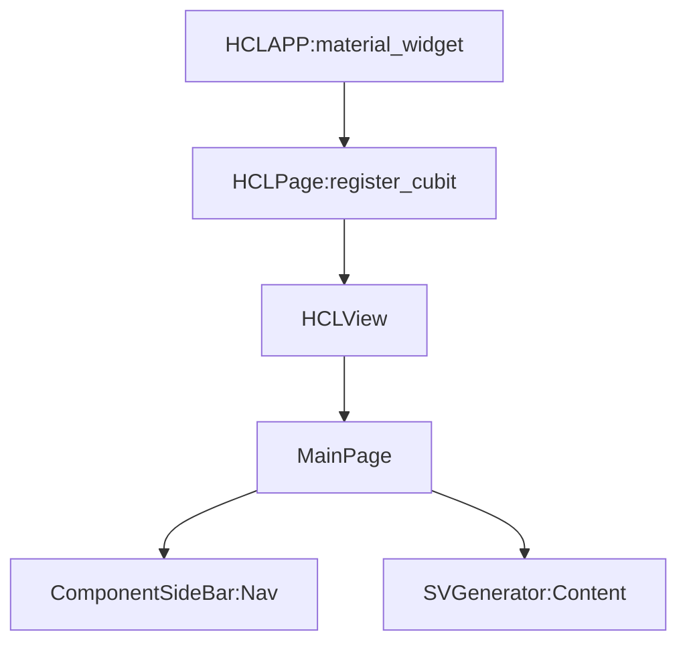

# confapp_flutter

- [https://github.com/burhanrashid52/WhatTodo/tree/master/lib](https://github.com/burhanrashid52/WhatTodo/tree/master/lib)
- [https://github.com/felangel/bloc/tree/master/examples/flutter_shopping_cart/lib/cart/models](https://github.com/burhanrashid52/WhatTodo/tree/master/lib)

## Widget Tree

