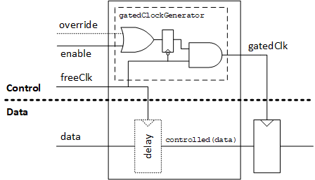

# Clock Gating

ROHD-HCL includes a generic clock gating component for enabling and disabling clocks to save power. The implementation supports multiple scenarios and use cases:

- Easily control whether clock gating `isPresent` or not without modifying the implementation.
- Delay (or don't) controlled signals that are sampled in the gated clock domain, depending on your timing needs.
- Optionally use an override to force all clock gates to be enabled.
- Bring your own clock gating implementation and propagate the instantiation and any additionally required ports through an entire hierarchy without modifying any lower levels of the design.
- Automatically handle some tricky situations (e.g. keeping clocks enabled during reset for synchronous reset).



A very simple counter design is shown below with clock gating included via the component.

```dart
class CounterWithSimpleClockGate extends Module {
  Logic get count => output('count');

  CounterWithSimpleClockGate({
    required Logic clk,
    required Logic incr,
    required Logic reset,
    required ClockGateControlInterface cgIntf,
  }) : super(name: 'clk_gated_counter') {
    clk = addInput('clk', clk);
    incr = addInput('incr', incr);
    reset = addInput('reset', reset);

    // We clone the incoming interface, receiving all config information with it
    cgIntf = ClockGateControlInterface.clone(cgIntf)
      ..pairConnectIO(this, cgIntf, PairRole.consumer);

    // In this case, we want to enable the clock any time we're incrementing
    final clkEnable = incr;

    // Build the actual clock gate component.
    final clkGate = ClockGate(
      clk,
      enable: clkEnable,
      reset: reset,
      controlIntf: cgIntf,
    );

    final count = addOutput('count', width: 8);
    count <=
        flop(
          // access the gated clock from the component
          clkGate.gatedClk,
          // by default, `controlled` signals are delayed by 1 cycle
          count + clkGate.controlled(incr).zeroExtend(count.width),
          reset: reset,
        );
  }
}
```

Some important pieces to note here are:

- The clock gate component is instantiated like any other component
- We pass it a `ClockGateControlInterface` which brings with it any potential custom control. When we punch ports for this design, we use the `clone` constructor, which carries said configuration information.
- We enable the clock any time `incr` is asserted to increment the counter.
- Use the gated clock on the downstream flop for the counter.
- Use a "controlled" version of `incr`, which by default is delayed by one cycle.

The `ClockGateControlInterface` comes with an optional `enableOverride` which can force the clocks to always be enabled. It also contains a boolean `isPresent` which can control whether clock gating should be generated at all. Since configuration information is automatically carried down through the hierarchy, this means you *can turn on or off clock gating generation through an entire hierarchy without modifying your design*.

Suppose now we wanted to add our own custom clock gating module implementation. This implementation may require some additional signals as well. When we pass a control interface we can provide some additional arguments to achieve this. For example:

```dart
ClockGateControlInterface(
  additionalPorts: [
    Port('anotherOverride'),
  ],
  gatedClockGenerator: (intf, clk, enable) => CustomClockGatingModule(
    clk: clk,
    en: enable,
    anotherOverride: intf.port('anotherOverride'),
  ).gatedClk,
);
```

Passing in an interface configured like this would mean that any consumers would automatically get the additional ports and new clock gating implementation. Our counter example could get this new method for clock gating and a new port without changing the design of the counter at all.
